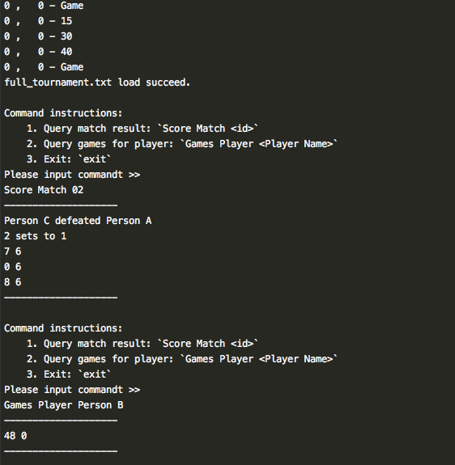

# Tennis Calculator

This project could parse tennis score history file and provided query for match result and player statistics.

## Requirements
To make it convenient to run and test, this project only used built-in library, so none extra packages needed. 

The Python version should be 3.6 or above due to used [f-string formatting](https://docs.python.org/3/reference/lexical_analysis.html#f-strings) which is a new feature from Python 3.6.
- Python 3.6 or above
- Git

## Installation
Simply git clone this repo and run `main.py`
```
git clone https://github.com/lorne-luo/tennis_calculator.git
python3 main.py full_tournament.txt
```

**Screenshot:**


 
## How to test
Run
```
python3 -m unittest discover
```

## Code explaination

The implementation are split into 4 model classes: Tournament, Match, Set and Game.

They followed the natural hierarchy structure: tournament contains matchs, match contain sets, set contain games, very easy to understand.

In each class of match, set and game have function to add score, get winner and get player point, the func calling from upper level will invoke corresponding function in lower level object.


## Development & Tools

1. This project followed TDD development process, test case had been added in the first commit.

2. Developed by Mac OS and PyCharm 

3. All codes are formatted by [black](https://github.com/python/black) to improve the readability. 